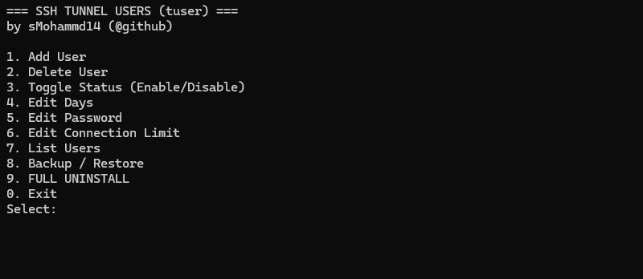
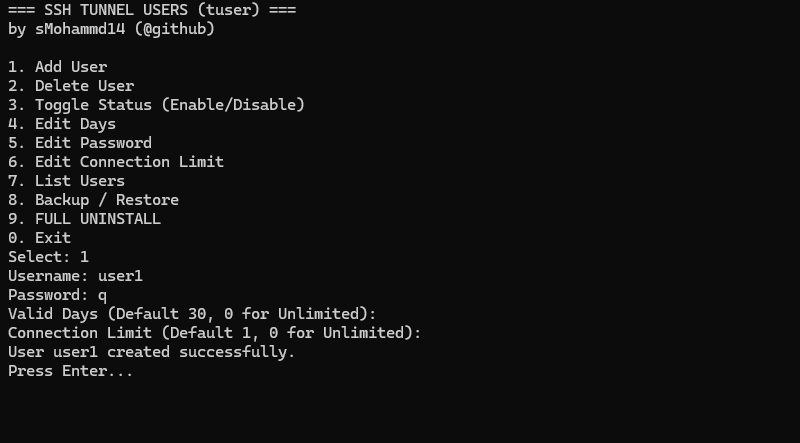
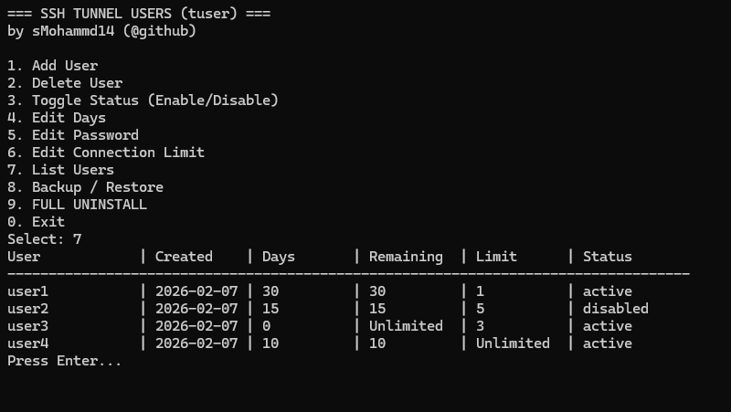

# فارسی
---
# TUser - مدیریت کاربران محدود شده SSH

این برنامه به شما کمک می‌کند کاربرانی روی سرور ایجاد کنید که **فقط می‌توانند از SSH برای عبور ترافیک استفاده کنند** و هیچ کار دیگری انجام ندهند (حتی گرفتن شل یا اجرای دستورات دیگر).

با کمک اسکریپت آسان نصب، فایل رو دانلود کنید و اجرا کنید، خودش سیستم رو آپدیت کرده و jq رو برای کار با فایل های JSON نصب میکنه (برای کار با یک دیتابیس متنی)، این تنها چیزیه که شما بهش نیاز دارید!

بعد از نصب شما با کامند `tuser` میتونید از طریق یک منو تعاملی، با برنامه به راحتی کار کنید.

## ✨ امکانات برنامه

با این برنامه میتونید:

- کاربرانی رو اضافه کنید به سیستم که از کاربران مجاز سیستم (کاربران عادی SSH) متمایز هستند و این مدیریت به صورت هوشمند انجام میشه، یعنی نمیتونید با این برنامه سایر کاربران رو که با این برنامه ایجاد نشدن، مدیریت کنید. در واقع این برنامه فقط کاربران خودش رو میشناسه و مدیریت میکنه!
- امکانات جانبی که این برنامه در اختیار شما میزاره، شامل:
  - غیر فعال کردن کاربر
  - تنظیم محدودیت روزهای قابل استفاده برای کاربر
  - تعیین محدودیت استفاده همزمان از یک اکانت
  - بکاپ گیری و رستور بکاپ
- همچنین میتونید به راحتی تمام برنامه رو از روی سیستم به همراه فایل ها و دیتا بیس و حتی یوزر های ایجاد شده با این برنامه حذف کنید.
- **مدت زمان:** اگر مقداری وارد نکنید 30 روز خواهد بود و اگر 0 وارد کنید بدون انقضا خواهد بود.
- **اتصال همزمان:** اگر مقداری وارد نکنید 1 اتصال همزمان مجاز خواهد بود و اگر 0 وارد کنید بدون محدودیت اتصال همزمان خواهد بود.
- هنگام رستور بکاپ، این برنامه به صورت خودکار کاربران رو ایجاد خواهد کرد.

## ⚠️ نکات مهم

- کاربران این برنامه با کاربران سیستم در نام یکی خواهند بود. یعنی اگر کاربری به نام `user1` توی سیستم دارید نمیتونید با این برنامه ایجاد کنید (پیام مناسب میده) پس هنگام رستور به این مورد دقت کنید.
- در نتیجه لازم هست قبل از رستور، بررسی کنید یوزری که توی فایل بکاپ هست، یوزری با همین یوزرنیم توی سیستم نباشه.
- با حذف برنامه، بکاپ ها هم حذف میشن.
- مسیر فایل های بکاپ: `/opt/tuser/backups`
- برای بررسی اعتبار اکانت و قطع ارتباط پس از مدت مجازف این برنامه ساعت 03:00AM این بررسی رو انجام میده و اکانت رو غیر فعال میکنه، یعنی کاربری که مثلا تا تاریخ 2026/07/02 اعتبار داره، ساعت 03:00AM تاریخ 2026/07/03 اکانتش غیر فعال خواهد شد.
- هنگام نصب برنامه، ساعت سیستم به ساعت ایران تغییر میکنه. (برای تضمبن عملکرد غیر فعال سازی خودکار اکانت ها). میتونید بعد از نصب، تاریخ سیستم رو مجددا تغییر بدید.
- رمزهای عبور در فایل‌های پشتیبان به صورت **cleartext** (متن آشکار) ذخیره می‌شوند. این طراحی عمدی است تا امکان ویرایش دستی رمزها قبل از عملیات بازیابی (restore) وجود داشته باشد.
## 📋 منوی برنامه

منو برنامه شامل:

1. اضافه کردن کاربر
2. حذف کاربر
3. فعال/غیر فعال کردن کاربر
4. اصلاح روزهای باقی مانده
5. اصلاح پسورد کاربر
6. اصلاح تعداد کاربر همزمان برای یک اکانت
7. مشاهده لیست کاربران
8. بکاپ / رستور
9. حذف کامل
0. خروج

## 🔮 به‌روزرسانی آینده

به عنوان آپدیت بعدی، محدودیت حجم هم اضافه خواهد شد.

## 📷 تصاویر

# English
---
# TUser - Restricted SSH User Manager

This program helps you create users on the server who **can only use SSH for traffic tunneling** and cannot do anything else (not even get a shell or run other commands).

With the easy installation script, download and run the file. It will update the system and install `jq` for working with JSON files (for working with a text database). This is all you need!

After installation, you can use the `tuser` command to easily work with the program through an interactive menu.

## ✨ Program Features

With this program you can:

- Add users to the system that are distinct from regular system users (normal SSH users). This management is done intelligently, meaning you cannot manage other users who were not created with this program. In fact, this program only recognizes and manages its own users!
- Additional features provided by this program include:
  - Disabling users
  - Setting usage day limits for users
  - Setting concurrent connection limits for an account
  - Backup and restore functionality
- You can also easily remove the entire program from the system along with its files, database, and even users created with this program.
- During restore, the program will automatically create the users.

## ⚠️ Important Notes

- Users created by this program will have the same names as system users. This means if you already have a user named `user1` in the system, you cannot create it with this program (appropriate message will be shown). So be careful when restoring.
- Therefore, before restoring, make sure that users in the backup file don't already exist in the system with the same username.
- When you remove the program, backups will also be deleted.
- Backup files path: `/opt/tuser/backups`
- **Duration:** If you don't enter a value, it will be 30 days, and if you enter 0, it will be without expiration.
- **Concurrent Connections:** If you don't enter a value, 1 concurrent connection will be allowed, and if you enter 0, it will be without concurrent connection limit.
- To check account validity and terminate connections after the allowed period, this program performs the check at `03:00` AM and disables the account. For example, if a user is valid until 2026/07/02, their account will be disabled at 03:00 AM on 2026/07/03.
- During program installation, the system time is changed to Iran time `(Asia/Tehran)`. This ensures the proper functioning of the automatic account deactivation feature. You can change the system date/time again after installation if needed.
- Passwords are stored as **cleartext** in backup files. This is by design to allow manual editing of passwords before performing restore operations.

## 📋 Program Menu

The program menu includes:

1. Add user
2. Remove user
3. Enable/Disable user
4. Modify remaining days
5. Change user password
6. Modify concurrent connections limit
7. View user list
8. Backup / Restore
9. Complete removal
0. Exit

## 🔮 Future Update

As a future update, data usage limits will be added.

## 📷 ScreenShots

